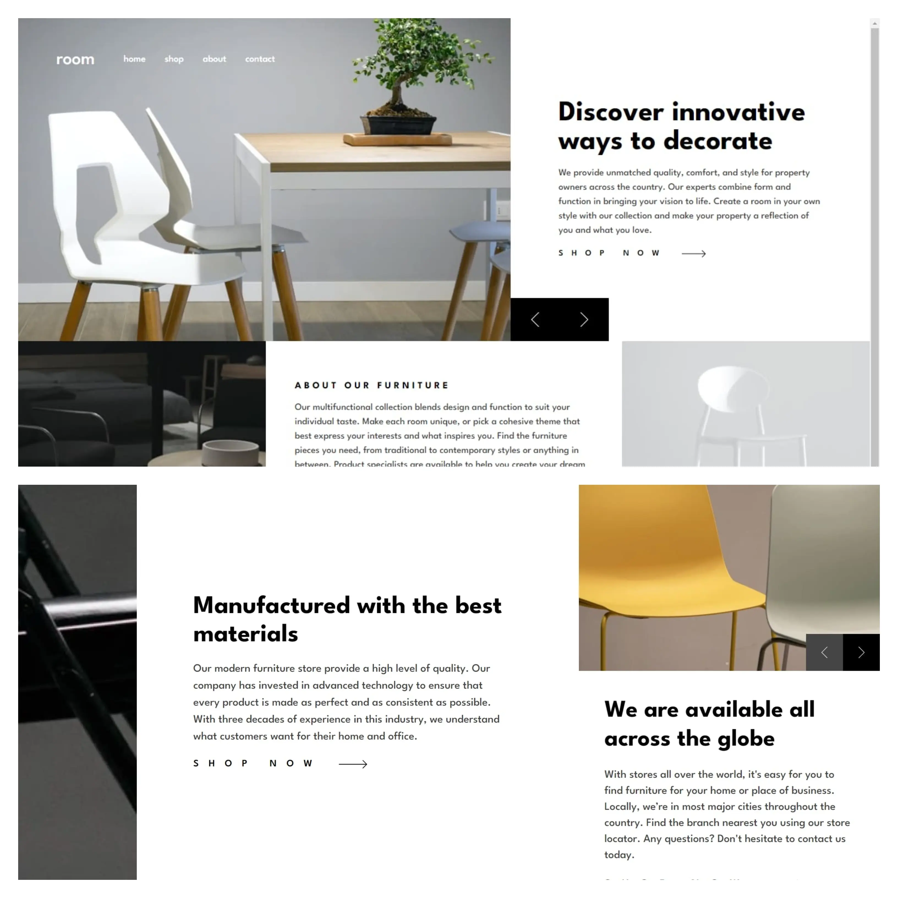

# Frontend Mentor - Room homepage solution

This is a solution to the [Room homepage challenge on Frontend Mentor](https://www.frontendmentor.io/challenges/room-homepage-BtdBY_ENq). Frontend Mentor challenges help you improve your coding skills by building realistic projects. 

## Table of contents

- [Overview](#overview)
  - [The challenge](#the-challenge)
  - [Screenshot](#screenshot)
  - [Links](#links)
- [My process](#my-process)
  - [Built with](#built-with)
  - [What I learned](#what-i-learned)
  - [Continued development](#continued-development)
- [Author](#author)


**Note: Delete this note and update the table of contents based on what sections you keep.**

## Overview

### The challenge

Users should be able to:

- View the optimal layout for the site depending on their device's screen size
- See hover states for all interactive elements on the page
- Navigate the slider using either their mouse/trackpad or keyboard

### Screenshots




### Links

- Live Site URL: [Vercel](https://room-home-page-eight.vercel.app/)

## My process

### Built with

- HTML5
- CSS3 Flexbox and Grid
- [React](https://reactjs.org/) - JS library
- [Tailwind](https://tailwindcss.com/) - For styles

### What I learned

For this challenge I felt it was more about design than functionality, as among the most difficult was resizing and switching to different screen breakpoints. So, I decided to use more grid on flexbox to address design, and I can say that it makes me have more control over design than flexbox could.
Still, it gave me trouble and surprised me, as this was one of the few times I have used it.

This is a tailwind css code snippet. Here, while I was learning more about grid, I could switch more efficiently between design or experimenting with a new one if I wanted:

```css
  gridTemplateColumns: {
        'headerLayout': 
        `auto minmax(auto, 600px)`,
        'homePageLayout': 
        `1fr`,
        'aboutLayout': 
        `auto minmax(180px, auto) auto`,
        'tabletAboutLayout': 
        `1fr 1fr`
      },
      gridTemplateRows: {
        'homePageLayout': 
        `60vh 40vh`,
        'homePageLayoutMobile':
        `100vh 100vh`,

        'headerLayout':
        `60vh 40vh`,
        'tabletHeaderLayout':
        `1fr`,
        'mobileHeaderLayout': 
        `minmax(0, 360px) auto`,
        ...
```

### Continued development

I definitely want to learn to do more things with grid because when the design becomes more complex this
seems to be a good option to address it.

Also, this is the second time I use tailwind and it gave me problems with importing and using images. Because I wanted to change the path of the images instead of using a carousel using the overflow trick to slide between slides or divs. This could also be a good thing to improve,  do the slider as it also gives the possibility to add some animations and transitions.

The last to mention is that, a smooth scrolling or scrolljacking to scroll between sections
could be insteresting in this design, which looks a little luxurious. So, I note that as a topic for future readings.

## Author

- Website - [juandgr](https://juandgr.vercel.app/)
- Frontend Mentor - [juandavid015](https://www.frontendmentor.io/profile/juandavid015)


This project was bootstrapped with [Create React App](https://github.com/facebook/create-react-app).

## Available Scripts

In the project directory, you can run:

### `npm start`

Runs the app in the development mode.\
Open [http://localhost:3000](http://localhost:3000) to view it in your browser.

The page will reload when you make changes.\
You may also see any lint errors in the console.


